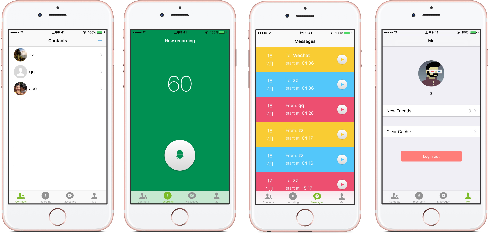

# RemindMe
给好友发送一段语言留言，好友收到好可以等时间到时收听
## 安装
```
git clone https://github.com/vzyw/RemindMe.git
cd RemindMe
pod install
```
## 预览图



## 使用的开源库
- [Alamofire](https://github.com/Alamofire/Alamofire)
- [WechatKit](https://github.com/starboychina/WechatKit)
## 服务端程序
[https://github.com/vzyw/RemindMe-server/](https://github.com/vzyw/RemindMe-server/)
